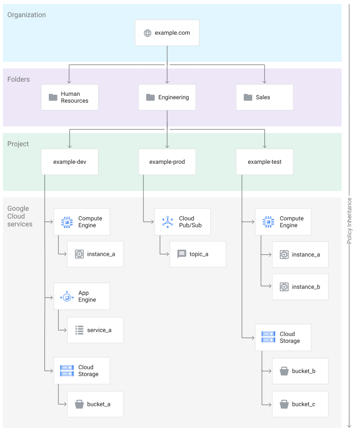

# Resource Organization

Google Cloud’s resource hierarchy contains four levels, and starting from the bottom up they are: resources, projects, folders, and an organization node.

At the first level are resources. These represent virtual machines, Cloud Storage buckets, tables in BigQuery, or anything else in Google Cloud.

Resources are organized into projects, which sit on the second level.

Projects can be organized into folders, or even subfolders.These sit at the third level.

And then at the top level is an organization node, which encompasses all the projects, folders, and resources in your organization.

It’s important to understand this resource hierarchy because it directly relates to how policies are managed and applied when you use Google Cloud.

Policies can be defined at the project, folder, and organization node levels.Some Google Cloud services allow policies to be applied to individual resources, too.

Policies are also inherited downward.This means that if you apply a policy to a folder, it will also apply to all of the projects within that folder.

Projects are the basis for enabling and using Google Cloud services, like managing APIs, enabling billing, adding and removing collaborators, and enabling other Google services.

Each project is a separate entity under the organization node, and each resource belongs to exactly one project.

Projects can have different owners and users because they’re billed and managed separately.

Each Google Cloud project has three identifying attributes: a project ID, a project name, and a project number.

The project ID is a globally unique identifier assigned by Google that can’t be changed after creation.

They’re what we refer to as being immutable.

Project IDs are used in different contexts to inform Google Cloud of the exact project to work with.

Project names, however, are user-created.

They don’t have to be unique and they can be changed at any time, so they are not immutable.

Google Cloud also assigns each project a unique project number.

It’s helpful to know that these Google-generated numbers exist, but we won’t explore them much in this course.

They’re mainly used internally by Google Cloud to keep track of resources.

Google Cloud’s Resource Manager tool is designed to programmatically help you manage projects.

It’s an API that can gather a list of all the projects associated with an account, create new projects, update existing projects, and delete projects.

It can even recover projects that were previously deleted, and can be accessed through the RPC API and the REST API.

The third level of the Google Cloud resource hierarchy is folders.

Folders let you assign policies to resources at a level of granularity that you choose.

The resources in a folder inherit policies and permissions assigned to that folder.

A folder can contain projects, other folders, or a combination of both.

You can use folders to group projects under an organization in a hierarchy.

For example, your organization might contain multiple departments, each with its own set Google Cloud resources.

Folders allow you to group these resources on a per-department basis.

Folders also give teams the ability to delegate administrative rights so that they can work independently.

As we mentioned earlier, the resources in a folder inherit policies and permissions from that folder.

For example, if you have two different projects that are administered by the same team, you can put policies into a common folder so they have the same permissions.

Doing it the other way--putting duplicate copies of those policies on both projects–could be tedious and error-prone.

If you needed to change permissions on both resources, you would have to do that in two places instead of just one.

To use folders, you must have an organization node, which is the very topmost resource in the Google Cloud hierarchy.

Everything else attached to that account goes under this node, which includes folders, projects, and other resources.

There are some special roles associated with this top-level organization node.

For example, you can designate an organization policy administrator so that only people with privilege can change policies.

You can also assign a project creator role, which is a great way to control who can create projects and, therefore, who can spend money.

How a new organization node is created depends on whether your company is also a Google Workspace customer.

If you have a Workspace domain, Google Cloud projects will automatically belong to your organization node.

Otherwise, you can use Cloud Identity, Google’s identity, access, application, and endpoint management platform, to generate one.

Once created, a new organization node will let anyone in the domain create projects and billing accounts, just as they could before.

You’ll also be able to create folders underneath it and put projects into it.

Both folders and projects are considered to be “children” of the organization node.

